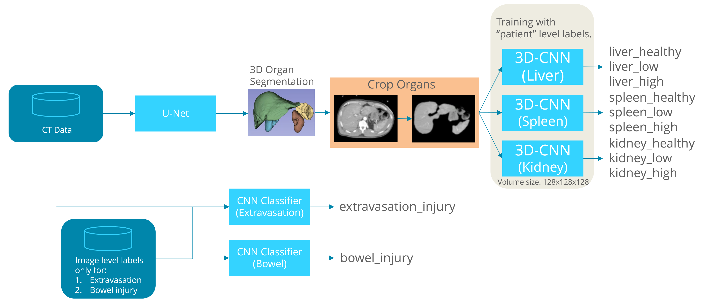

# RSNA 2023 Abdominal Trauma Detection

kaggleの[RSNA2023コンペ](https://www.kaggle.com/competitions/rsna-2023-abdominal-trauma-detection)の実験管理用リポジトリ。  
山本の[Notion](https://blue-foe-524.notion.site/RSNA2023-2c6adfcd57594dd69532a2ff347d55fe?pvs=4)はこちら。    


# Prerequisites
必ずしも統一する必要はありません。  
以下構成と、kaggle notebook環境が衝突しないことを確認済み。  
- python 3.9.12
- pytorch 1.11.0
- その他機械学習に用いられる一般的なライブラリを必要に応じてinstall
- 特別必要に思われるモジュールはrequirements.txtに記載
- kaggle notebookで使用する場合、segmentation-models-pytorchのオフラインインストールが必要です。[このnotebook](https://www.kaggle.com/code/tachyon777/rsna2023-exp013)を参照してください。


# Getting Started
dataディレクトリ直下に`rsna-2023-abdominal-trauma-detection`というディレクトリを配置し、その中にデータセットを配置してください。
なお、このディレクトリは直接学習には使用しないかつデータ量が大きい(約500GB)ので、外付けHDDなどに配置の上シンボリックリンクを作成することをオススメします。  
例：
```
.
└── data
    └── rsna-2023-abdominal-trauma-detection
        ├── image_level_labels.csv
        ├── sample_submission.csv
        ├── segmentations
        ├── test_dicom_tags.parquet
        ├── test_images
        ├── test_series_meta.csv
        ├── train.csv
        ├── train_dicom_tags.parquet
        ├── train_images
        └── train_series_meta.csv
```

## Create Dataset
学習用データ(`dataset001`)は別に整形して用意し、dataディレクトリ配下に作成。学習用データは再現できるようにコードをnotebooksに配置(`exp002.ipynb`)。  
更に、`dataset001`から`exp005.ipynb`を介して`dataset002`を作成。こちらは、3次元の臓器CTデータとなる。  
`dataset001`: 約750GB, 処理時間12時間程度  
`dataset002`: 約60GB, 処理時間10時間程度  

## ファイル命名規則
**ファイル名に意味を含めない**こと。[Notionの実験管理ページ](https://www.notion.so/RSNA2023-2c6adfcd57594dd69532a2ff347d55fe?pvs=4)と紐付けて内容を管理する。
深層学習を行うファイル名：  
exp000_train.ipynb  
exp000_eval.ipynb  
その他探索的データ分析・実験・検証を行うファイル名：  
exp000.ipynb  


# Experiment Overview

## exp012

exp004, 009, 011の3モデルを組み合わせた推論パイプライン。  
与えられたデータから推察される、最もオーソドックスな構成。  
それぞれのモデルの詰めは甘い、ベースライン的モデル。  
exp004: U-Netの部分  
exp009: 3D-CNNの部分  
exp011: CNN Classifierの部分  